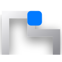

<div align="center">
  

  # FixTheFlow
  **A high-fidelity, privacy-first screen recording utility.**

  <p align="center">
    Built at the intersection of rigorous design systems and modern web architecture.
  </p>

</div>

---

## ✦ The Vision

FixTheFlow was designed to solve a fundamental UX problem: **demonstrating workflows without compromising sensitive data.** 

As design engineers, we believe that privacy shouldn't come at the cost of friction. FixTheFlow replaces clunky post-production editing with an elegant, client-side encryption flow. We intercept the DOM prior to recording, allowing users to interactively mask sensitive nodes (inputs, text, imagery) directly on the canvas. 

The result is a `.webm` artifact that is processed entirely locally, maintaining strict data sovereignty while delivering a frictionless user experience.

---

## ✦ Design System & Craft

Our UI architecture strictly adheres to a premium, photography-first aesthetic, heavily inspired by Apple's Human Interface Guidelines. We prioritize content over chrome, utilizing negative space, stark contrast, and intentional typography to guide the user's eye.

### Typography & Rhythm
- **Primary Typefaces:** We rely on the `SF Pro Display` and `SF Pro Text` families, gracefully degrading to `system-ui`.
- **Micro-Typography:** We apply rigorous negative tracking (`-0.374px` to `-0.224px`) to achieve the signature "tight" cadence of modern premium interfaces.

### Color & Elevation Tokens
- **Canvas & Ink:** The application utilizes a stark juxtaposition of pure white (`#ffffff`) surfaces against near-black (`#1d1d1f`) typography for maximum legibility.
- **Action Blue:** To eliminate cognitive overload, we enforce a monochromatic interaction paradigm. Every primary interactive surface utilizes a singular, distinct Action Blue (`#0066cc`).
- **Destructive/Recording Actions:** Context-heavy states (like actively recording) are immediately communicated via a stark Action Red (`#ff3b30`).
- **Materiality:** Floating utility bars leverage deep `backdrop-filter: blur(20px)` properties over an 80% opacity parchment canvas (`#f5f5f7`), ensuring they maintain context without obscuring the underlying workflow.

### Motion & Micro-Interactions
- We reject abrupt state changes. Elements enter the viewport via cubic-bezier `slideUp` and `fadeIn` orchestrations.
- Buttons utilize a physical `scale(0.95)` depress animation on the active state rather than hover color shifts, grounding the interface in digital materiality.

---

## ✦ Technical Architecture

FixTheFlow is engineered to be as performant as it is beautiful. 

- **State Management:** Driven by **Svelte 5's** surgical reactivity (`$state`, `$derived`), ensuring zero dropped frames when interacting with the DOM mask overlays.
- **Extension API:** Deep integration with Chrome's `Offscreen Document API` to reliably mux tab video streams with hardware microphone inputs.
- **Tooling:** Bundled via **Vite** and **CRXJS**, providing sub-second HMR during the design iteration loop.
- **Fidelity:** UI elements are injected cleanly into the host page's DOM via isolated shadow/high-z-index containers to prevent CSS bleed from host sites.

---

## ✦ Running the Project

For design engineers looking to iterate on the component library or extend the masking logic:

1. **Clone & Install:**
   ```bash
   git clone https://github.com/Anxthu/FixTheFlow.git
   cd FixTheFlow
   npm install
   ```

2. **Compile the Artifacts:**
   ```bash
   npm run build
   ```
   *(Use `npm run dev` for Vite's HMR server).*

3. **Deploy Locally:**
   - Navigate to `chrome://extensions/` in Chromium.
   - Toggle **Developer mode**.
   - Select **Load unpacked** and target the generated `/dist` directory.

---

<div align="center">
  <p><i>Crafted with intention. Designed for flow.</i></p>
</div>
